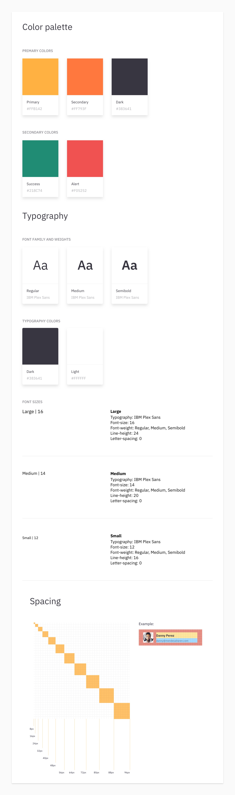
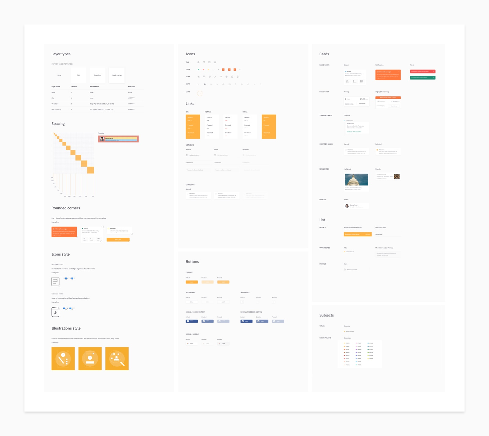

# 4. Design Systems

This is the core tool around which our methodology revolves on. Hence, we thought it best to dedicate an entire chapter to explaining **what we mean by design system,** what **design principles** guide us when managing it, and finally **what elements** make up our systems at a morphological level.

## 1. What is a design system?

This tool allows the team to **establish patterns** and have a series of elements that can, and should, be reused to create functionalities. The **modularity** of the system is what makes it possible to create from a basic unit to more complex components. It establishes **rules** that help us to work as a team in an inline way through a series of principles.

In addition, the design system reflects the point of convergence between the design and development teams. Thanks to it, we are able to **implement a clear and consistent language** from which to create and grow our products.

**A design system could be understood as:**

* A common language.
* A balance between rigid regulation and the chaos of freedom.
* A collection of reusable elements guided by clear documentation.
* A set of patterns and practices that are shared within a team in a coherent and organized manner. Each pattern describes a problem that occurs frequently and defines and proposes a solution for it.

The design system has to be flexible and stay alive in the long term. A design system is not static, but dynamic. It evolves with the product and its design.

### 1.1 What value does it bring?

Using a design system guarantees the **consistency** of our products. This has a positive impact on the user experience and significantly shortens product ideation, development, and production times. On the other hand, design systems are a particularly useful tool for creating digital products that can scale and **grow rapidly in a manageable way.** Last but not least, one value it brings is that it allows you to spend less time thinking about redundant details and more time thinking about the product.

Although there are some similarities, the design system is neither a brand manual nor a style guide, nor a substitute for them. You can live with them and each one brings different values. The main difference is that the design system is not a static reference manual that is limited to explaining what the elements should look like. As we have already mentioned, the design system is a living entity that contains a common language, principles, and tools that help build coherent products.

## 2. **Principles**

When making decisions regarding the management of design systems, we are guided by a set of **principles** that are shared by all team members. Thanks to them we managed to lay the foundations of what we consider a good product. In our opinion, design systems should be:

* **Systemic**. The visual design uses patterns and reuses elements. This gives consistent cohesion to the product and speeds up the creation and maintenance processes.
* **Reticular**. The design must use a defined system of proportions, to harmonize and organize the whole.
* **Rational**. Visual design should be based on logical, well-thought-out decisions.
* **Aesthetic**. The aesthetic quality of the design has a direct impact on the usefulness and usability of the products.
* **Understandable**. Our challenge is to make self-explanatory products.

These principles also have a clear influence throughout our production process.

### 2.1 Specific principles

Beyond the general rules that serve as a starting point when using a design system, we also provide each rule with a series of **particular principles.** These have the aim of bringing a unique personality to the system. For example, a design system for a public entity could establish impartiality as a principle. Whoever manages this system should stick to this maxim when creating features that do not influence the user's decision making.

## 3. **Styles**

### 3.1 Color

Color is a very important element of visual communication, therefore, it is necessary to make **intelligent and deliberate** use of it. When creating design systems we distinguish the following types of colors: \*\*

* **Branded**. Colors normally associated with branding, which define and give personality to the brand of the product. The main function of these colors is to accentuate.  _All primary colors will be grouped on the primary palette._
* **Complementary**. Groups of colors rich enough to work when creating applications such as illustrations, photographs or generate background colors.   
  _All defined secondary colors will be grouped in the secondary palette._

  **Typefaces**. At least one dark color and one light color should be established for use in typography. You can also set other text styles that have a different color to those mentioned.   
  _All typographic colors will be grouped in the secondary palette, except when the color of the text corresponds to some primary color._

### 3.2 Layout

To organize the space we use **the grid.** This is a tool that helps us distribute the elements documented in the design system. It must be used in a structured way to create functional components that will articulate the product.

This grid must be defined mathematically, thus providing the rules that define the size and position of the elements placed on it. In this way, we limit the possibilities and speed up decision-making on the principle of a harmonious system of proportional measures. In our case, we establish two variables that define the grid:

* **Columns**. They help us structure space horizontally. Depending on the needs of the project, an even number of columns between 2 and 12 is usually established. It is necessary to establish the width of each column, the gutter, and the margin of the group of columns with respect to the edges.
* **Baseline**. It is used to organize the space vertically. It must be equivalent to the height of the spacing of the main body of text. In this way, all the elements will be aligned to the same element and transmit a sense of order.

### 3.3 Rule of 8

While the minimum unit of a digital grid is the individual pixel, our system will be based on a grid of **vertical and horizontal increments of 8 pixels**. Due to the importance that this way of organizing the grid has for us, we have decided to allocate its own section.

Each page size must be a multiple of 8. This includes column widths, margins, texts, icons, images, etc. Only by proceeding rigorously in this way can we ensure that all the elements are perfectly aligned.

When applying the rule of 8 to **typography**, we make an exception and take the liberty of establishing the baseline in multiples of 4. In this way, we obtain greater flexibility when it comes to creating our line-height spacing, establishing a comfortably readable experience. For example, if we stick to multiples of 8, for a font with a size of 12 pixels, 16 spacing might be insufficient and 24 too much.

There are **specific cases** in which it is not easy to know clearly how to use the 8-point grid. For example: in elements with a line at the edge. In this case, this line must be defined in such a way that it occupies space towards the inside of the button. We will not calculate its thickness when measuring spacing.

**Exceptions to the rule**  
  
There are projects where an **8-pixel grid is too big**. In these cases, the team analizes the possibilities of using a global 4-pixel grid. This way, we have more versatility when defining spaces, proportions and hierarchies on interfaces with a lot of information.

### 3.4 Typography

Since the written letter is the main form of visual communication, the **use of good typography** is very important. This usage makes the reading process easier and a great experience seamless. In addition, typography is a great tool to give a specific **personality** to different projects and to establish a **tone of communication** that matches that personality.

Each typography has its particularities, and establishing dogmas about the numerical values that must be followed does not always work. However, some general guidelines can help us to structure the information and layout the texts as follows:

* **Establish clear hierarchies** between the different types of information. To do this, you can use different typefaces, weights, sizes, colors, etc. An interesting way to define the different hierarchies for a system is to first establish the values of the body text, and then define the rest.
* A **line spacing** between 1.4 and 1.6 times the font size usually works for a body of text. For highlights and headlines, we reduce that range to 1,2-1,4.
* Control the **margin width** of the body text. For a good reading experience, 45 and 75 characters per line is recommended. You can find more information on this topic here.
* Stick to **one or two typefaces** and use as few variations of font weights as possible. This is mainly due to performance issues in websites and apps.

### 3.5 Iconography

The iconography visually represents complex concepts that, at a glance, convey **useful information to the user**. It should be used sparingly and clearly, without giving rise to ambiguous messages.

Within the design system, **we group the icons according to their size**. We start from a minimum size of 16px and scale upwards in multiples of 8px depending on the needs of each system. To ensure that all icons of a given size have the same proportions, we place them on a transparent square background with these overall measurements.

It is important to define the **shape properties** of the icons so that there is a visual unit of reference between them. There can be both line icons and icons created from solid shapes. Both share visual properties that can be defined:

* **Line thickness.** It is important to set a standardized thickness for the entire group of icons. Even those created from solid forms could make use of lines at some point.
* **Endings.** As a general rule, they can be rectangular or rounded.
* **Corners.** Normally they can be: angular, rounded or beveled.

### 3.6 Layer Styles

We classify within this section certain characteristics that, by their **global nature**, are present in many of the pieces that make up the system and help to create its own tone and voice. With styles we define:

* **Color styles.** Here we include both colors related to branding, and those with a more functional character, such as those used in CTAs, error messages, etc..
* **Shape styles.** In this category, we find a mixture of values that we can apply, such as the roundness of the edges of shapes, opacity, shadows, blurs, etc..

## 4. Types of elements

Every system is by definition composed of elements that both articulate it and give it meaning. In order to make teamwork with the design systems viable, it is essential to use a **common and self-explanatory language** to name the different elements. **Based on their characteristics,** we propose the following classification:

* Fragments
* Components
* Modules
* Templates

### 4.1 01 Fragments

A fragment, as its name indicates, is something incomplete that only makes sense when it is associated with other fragments or components to generate meaning.

To give a more grounded example, a fragment could be an error icon within an alert because in the design it will never stand alone, it will always be accompanied by another element, the text. If it were to stand alone, it would be meaningless or misapplied.

Another example of a fragment would be items that are part of a set and should never be included separately \(table cells, tabs from a group of tabs, links from a navigation bar, options from a selector, etc.\). Therefore, the following elements will form part of the group of fragments:

* Icons
* Containers
* Items \(such as list, table, or tabs\)

### 4.2 02 Components

A component would be an element that makes sense by itself, that is, it is complete and does not need to be accompanied by other elements. They are used by themselves to perform a specific function.

It is important that a component fulfill a single function. In the case that it fulfills more than one function, that component should not be considered as such and will become part of a more complex category of elements such as a module or template.

To give an example, a component would be a button. A button does not need another element to fulfill its function and we can place it in an interface and it would not look incomplete or meaningless. The most common components are:

* Text blocks
* Button
* Links
* Text fields
* Selectors 
* Navigation bars 
* Images 
* Illustrations 
* Tab groups 
* Lists
* Tables

### 4.3 03 Modules

A module or section is a set of components that come together to adopt a function at a more global level. For example, a text field allows you to enter data \(it makes sense by itself\) but when combined with other data, buttons, etc. it can create a module that has a broader function, such as a registration form. Another example would be a footer. It often consists of links that in themselves make sense but in conjunction, they adopt a more global functionality that is navigation. Some examples of modules:

* Forms
* Modals
* Articles 
* Cards 
* Calendars 
* Galleries 
* Search bars

## 5. Naming system

The naming system is based on the groups differentiated in the preceding section. This allows the elements to be ordered and easy to find. Having the same naming rules in different projects helps us to achieve consistency and efficiency.

Below are some examples as a reference list when creating a new design system. There are projects in which not all of the components listed below appear, and other projects in which new ones will appear. The idea is to adopt the principles, and the product and design system will evolve together.

### 5.1 01 Fragments

* Icons 01 Fragments / Icon / \[Size\]px / \[Name of Icon\]  We work with icons contained in square boxes.  This dimension refers to the size, which must always be a multiple of 8px, thus maintaining our grid. We define the name of the icon in a way that describes it and its functional nature. This allows us to find and distinguish an icon without needing to see it.
* Containers 01 Fragments / Container / \[Container Type\]

### 5.2 02 Components

* Buttons

  02 Components / Button / \[Button Type\] / \[Status\]

  **Button Type**

  * Primary → Primary CTA's that should pertain to the main action
  * Secondary → Secondary CTA's that should pertain to secondary actions
  * Tertiary
  * Social → Facebook button, Google, Twitter, ...

  **State**

  All possible states of the button should always be available. To do this, your classification must follow:

  * 01 Active
  * 02 Hover
  * 03 Pressed
  * 04 Disabled

**An example would be:**

```text
- 02 Components / Button / Primary / 01 Active
- 02 Components / Button / Primary / 02 Hover
- 02 Components / Button / Primary / 03 Pressed
- 02 Components / Button / Primary / 04 Disabled
- 02 Components / Button / Secondary / 01 Active
```

* Links

  02 Components / Link / \[Estado\]

  **State**

  The five states we distinguish for the links are: active, hover, pressed, visited and disabled.

**An example would be:**

```text
- 02 Components / Link / 01 Active
- 02 Components / Link / 02 Hover
- 02 Components / Link / 04 Disabled
```

* Text fields

  02 Components / Text Field / \[State\]

  **State**

  For a text field, we always differentiate four states. These are reflected in our system as::

  * 01 Empty
  * 02 Focus
  * 02 Focus Typing \(Optional\)
  * 03 Filled
  * 04 Error

**An example would be:**

```text
- 02 Components / Text Field / 01 Empty
- 02 Components / Text Field / 03 Filled
```

* Selectors

  02 Components / Selection controls / \[Type\] / \[State\]

  **Type**

  We usually distinguish between four types of selectors, which are:

  * Dropdown
  * Radio button
  * Checkbox
  * Picker

  **State**

  Es importante, que siempre estén disponibles el estado de elemento seleccionado y del elemento sin seleccionar, para ello utilizamos:

  * Selected
  * Unselected

**An example would be:**

```text
- 02 Components / Selection Controls / Dropdown / Selected
- 02 Components / Selection Controls / Dropdown / Unselected
- 02 Components / Selection Controls / Radio button / Unselected
```

* Navigation bars

  02 Components / Navigation / \[Type of Navigation\]

  **Type of navigation**

  The most common types of navigation that we identify in projects are:

  * Navbar
  * Tabbar
  * Footer
  * Header

**An example would be:**

```text
- 02 Components / Navigation / Header
- 02 Components / Navigation / Navbar
- 02 Components / Navigation / Footer
```

* Images

  02 Components / Image

* Illustrations

  02 Components / Illustration / \[Name of illustration\]

  **Name**

  As we mentioned before with icons, having a descriptive illustration name allows us to identify it easily.

* Lists

  02 Components / List / \[List Type\]

  **List type**

  The list type references the functionality of the list, its distinguishing characteristics that differentiate it from others.

**An example would be:**

```text
- 02 Components / List / Default
- 02 Components / List / Default + Avatar
- 02 Components / List / Comment
```

* Tables

  02 Components / Tables / \[Table Type\]

### 5.3 03 Modules

* Modals

  03 Modules / Overlay / \[Type of modal\]

  **Type of modal**

  The type of modal describes it in a functional way, so that it is easily recognizable and identifiable.

* Cards

  03 Modules / Cards / \[Type of card\]

* Calendar

  03 Modules / Calendar

### 5.4 04 Templates

All templates follow the same naming system and we do not distinguish between their subgroups or smaller elements. We do it this way because we only consider a template to have views that are used repeatedly.

04 Templates / \[Name of Screen\]

**Name of the screen**

The name of the screen is the indicator of its functionality or objective, which allows us to identify it easily.

### Styles

* Color

  Color / \[Palette Type\] / \[Type\] / \[Color Name\]

  **Type of palette**

  Projects usually have two types of palettes, a primary palette, and a secondary palette.

  * **Primary** → for the primary pallet. This must contain the colors that define and give personality to the brand of the product, these are usually associated with branding. Its main function is to accentuate.
  * **Secondary** → for the secondary palette. It contains both complementary and typeface colors.

    **Type of color**

    We distinguish two types of color styles that can be applied on a layer: styles with a color fill and border styles. Distinguishing them by:

  * **Full**
  * **Outline**
  * **Color name**

    Each color must have a reference name. This name should not describe the color, but its functionality.

**An example would be:**

```text
- Color / Primary / Outline / Primary
- Color / Primary / Full / Secondary
- Color / Secondary / Outline / Light
- Color / Secondary / Outline / Dark
```

* Text

  \[Typography use\] / \[Size\] / \[Color\] / \[Weight\] / \[Alignment\]

  **Typography type**

  * Primary → main typeface
  * Secondary → secondary typeface

    Using this naming, instead of using the name of the typeface allows us that in the event that it changes it is not necessary to rename the styles.

    **Size**

    We group the texts by size. In order to follow the same naming in all projects, regardless of the sizes used, we apply the following scale:

  * XXXL
  * XXL
  * XL
  * L
  * M
  * S
  * XS
  * XXS
  * XXXS

    XXXL is the group that contains the texts with the greatest size, and XXXS those of smallest.

    **💡** We reference the size M, being the most used font size in the project. Based on this, we define which sizes are bigger and smaller than it.

    **Color**

    As a rule, we establish at least one dark color and one light color to use. However, there are times when we also use text styles of other colors defined in the palette.

    **Weight**

    Corresponds to the text weight associated with the font. For example:

  * Light
  * Regular
  * Medium
  * Semibold
  * Bold
  * Extrabold
  * ...

    **Alignment**

    We create text styles aligned to the center, left, and right and make them readily available. We use the following terminology:

  * Left Aligned
  * Centered
  * Right Aligned

```text
An example would be:

- Primary / M / Dark / Medium / Left Aligned
- Primary / M / Dark / Medium / Centered
- Secondary / M / Dark / Medium / Right Aligned
- Primary / L / Light / Regular / Right Aligned
```

* Opacity

  Opacity / \[Opacity number\]

  * **Opacity number**

    This number coincides with the percentage of opacity applied.

```text
An example would be:

- Opacity / 10
- Opacity / 20
- Opacity / 30
- Opacity / 40
- ...
```

## 6. **Documentation**

To document the elements that make up the design system, it is necessary to order the components to create them visually. These components **must be classified on different artboards** so that the styles and elements are separated.

In some projects, it may be that there are too many elements making it impossible to organize them all in the same place. In this case, you can divide the elements according to the group to which they belong: fragments, components, and modules.

Below is a visual example of how those styles and elements would be organized.

**Styles**

Perceivable components refer to those that reflect the identity and personality of the brand. The components of this artboard must be:

* Color → color palettes used in the product
* Typography → of the typography is necessary to document:
  * Typographic weights used 
  * Styles of texts used → must document the characteristics of each style of text: height, spacing between characters and weights in which it is used.
* Spacing → must show the grid used for the specific product



Internally, we have developed a plugin that complements our working software by **automating the creation of the structure of a design system**. This extension saves the mechanical work of creating color and text styles.

**Elements**

The visual organization of the elements must be respected and be a reflection of the rules we follow. This way we can divide them into groups in such a way that they are separated according to their specific functionality. The overview of the design system should be similar to the one shown in the following diagram:



Once we have finished the visual documentation, it is important to reflect in an attached document, or in the design system file itself, those elements that require a more meticulous level of detail. This attached documentation should give a brief description of what they are and how they are used.

