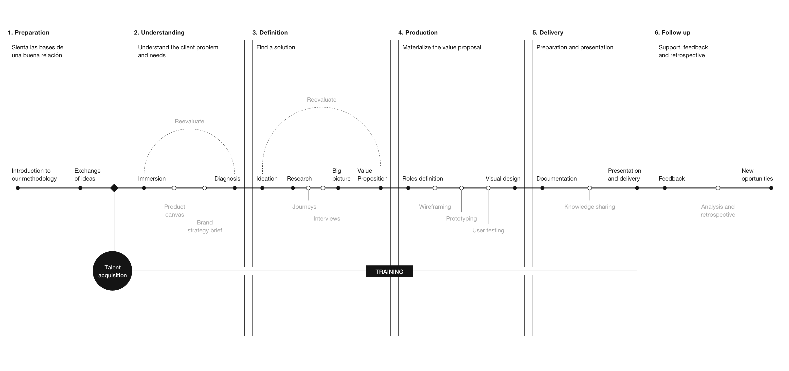
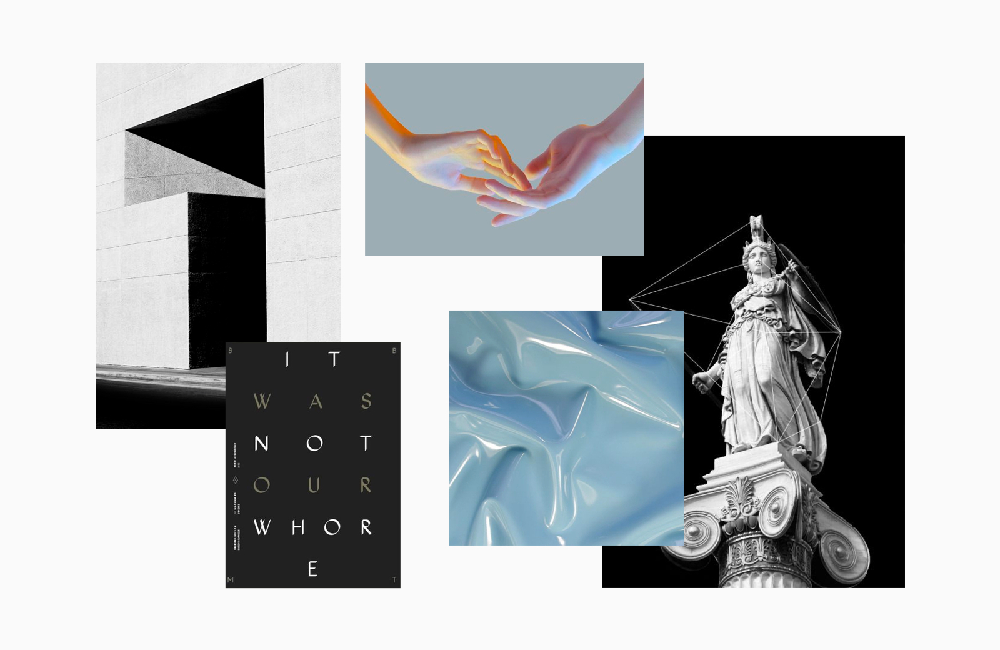

# 2. Process

## Introduction

**The importance of having a process**

> We overestimate the event and underestimate the process. Every fulfilled dream occurred because of dedication to the process.
>
> – John C. Maxwell

A well-structured and mature process is one of the keys to the success of any project. And although each project is a World in itself, there are numerous patterns that over time we have been developing and assimilating into our workflow, finding these recurring paths to help us achieve uniquely different results for each project we embark on.

From the first contact email or informal conversation to the final delivery, no matter how long a project takes, the process is always present. Predictability is the key. Following a defined roadmap and having it updated will help us reduce uncertainty and help our client awareness in all the events that will occur during their project.

We are not going to talk about a single process. It will not be a one-off discourse either. In reality, our process is composed of many processes: we have decided to distinguish three of them, which will alternately succeed each other in the order of our work.

* **Strategic definition processes**, which allow us to carve a path to follow to help our customers. The strategy starts with a market, context, objectives, needs and specific audiences, laying the foundations for all our work.
* **Product processes**, related to the solution of complex problems for users based on a series of objectives in a specific context.
* **Graphical definition processes**, since visual communication is our main tool \(and not the only one\) when it comes to making a digital product a success.

## 1. Preparation

Every project is born from a specific need from a client. But it is very common that the client themselves do not know exactly what they want or why they should trust us. It is very important to make sure our clients get to know us before starting a project, so that we transmit with clarity our culture and our approach to the work that we do, thus the client understands the differential value that we bring.

**This preparation can be given in several ways:**

* **We train the client.** Clients usually identify us with their preconceived idea about graphic design, focusing only on the aesthetic part. **When they start working with us, we teach them a holistic view of product design,** learning from our methodology.
* We train designers for the client. **A very important value that sets us apart** is the service of finding talent and training them during a project to then have seamless incorporation with the client.

**Why is it so important?**

* **Sharing vision and culture.** It is very important for your client to know what they are going to get from you and what they are not.
* **Avoid clients who do not fit in.** It is better not to do a job that is not part of your professional focus and refer it to other colleagues. It improves the sector, it is being honest with the client and it allows us to focus where we really can contribute.
* **Improve the value of our work.** By conveying the process and details of other projects, we enable the client to understand the day to day work complexity, which improves their ability to criticize and understand what we do.

### **1.1 Proposal**

The projects are born from the client's needs. He contacts us and tells us his needs and requirements through a **Briefing**. Based on this, a **proposal** is formalized, materializing the ideas and objectives that the client has in the services that we can offer to provide value in their product.

**Our proposals contain:**

* A detailed description of the phases that will make up the project.
* An estimate of the phases deadline.
* A detailed quote.
* Conditions of service.
* Materials and deliverables to be received by the client.
* On certain occasions, examples of other projects.

Although accepting or rejecting a proposal may make a priori seem like a rational decision, much of it is based on the emotional. For this reason, we must never neglect the detail, narrative, and graphics quality of our proposal: it must be a reflection of what we are offering and be clearly aligned with the identity and culture of our study.

Once the proposal has been approved, where the services are to be carried out and the objectives to be achieved have been defined, they are documented in Notion and the tasks are transferred to Asana. 

## 2. Understanding

The understanding phase allows us to establish a framework for our work. It is a series of exercises and processes that must follow a defined criteria. This way we can extract all the necessary information to help build the project in later phases. The conclusions in this phase will then be shared with the client as one more product and validated by him. Only in this way can we eliminate such expressions as "I like" from the vocabulary of our clients.

**Knowing the problem**

With any quality project, whether it is product, branding, or some other type of service, it begins with the understanding phase. It is the most important part of the whole process. The key is to define the problem we are facing. Because if we fail to define the problem, we may never find an adequate solution. There are many ways to discover the problem at hand. There is no single way to do this. The understanding phase starts from day one.

This is also the time to prepare the project at the technical level. We create our projects in Abstract and then give access to all the people involved in the project. This way they can see the progress and provide feedback throughout the project. It is also the time to prepare the folder structure, organize the documentation in Notion and to begin creating tasks in Asana.


👉 In How We Organize you will learn more about how to create this structure.  
👉 In Notion you can learn more about how we create and document a project.  
👉 In Asana you can see how we organize the tasks needed to complete each phase.  
👉 In Abstract you will read about this tool and how to set up a project.


### 2.1 Brief

One of the most common ways to begin to understand a project is through a brief. That is if there had not already been one before the proposal. There are a variety of formats. In its most common form, it is nothing more than a document detailing the client's request for services. But it can be much more than that. In our case, the brief allows us to test what the client wants, anticipate potential problems or benefits the project can bring. Basically, we want to extract as much information as possible. It is about asking the right questions and making the right proposals during the first meeting.

### 2.2 **Brand Strategy Brief**

To get to know our clients better, we usually send them a **Brand Strategy Brief.** This brief is a small questionnaire that invites the client to reflect strategically on its company's vision, mission, and values, as well as its target audience and competition. In this way, the mendesaltaren team can align itself with the client's vision and values, as well as its target audience and competitors. This brief is not always necessary, but it is essential if the project includes branding or if they do not have a well-defined strategy.

[Brand Strategy Brief](https://www.notion.so/mendesaltaren/Brand-Strategy-Brief-a3a812793b7843ffbe2fbb593c5a43e7)

### 2.3 Kick-Off

Once the Brand Strategy Brief has been completed, a **Kick-off meeting** is held in which the business objectives to be achieved and what is expected of mendesaltaren are delved into. The Kick-off meeting helps to establish measurable and attainable objectives, as well as setting a realistic roadmap. In this session, we must begin to unravel the problem, as well as throw out hypotheses as to why it has arisen. We want to be quick with coming up with possible solutions, both from our stakeholders, the client's team and our own team. In this way, we can assess how flexible and receptive our stakeholders are, and how easy it will be to convince them of our given solutions. A good exercise to use in this phase is the **Product Canvas,** which is explained below.

### 2.4 Product canvas

The product canvas is a very useful tool that allows us to have an overview of the product. It is very similar to a business canvas but focused on the product. It is, ultimately, a communication tool, which seeks to identify a client's unsatisfied needs as well as the shortcomings and benefits of the product. From here we can create a solid value proposition that is later translated into a set of non-prioritized functionalities. From this set of functionalities, "a wish list to Santa", we will be able to obtain the guidelines for the product.

This canvas involves representatives from the different teams which creates a more dynamic decision-making process. It is essential to have a facilitator taking notes of each participant's contributions. This facilitator should not take part in the decision-making process but focus on helping the rest communicate their ideas, prioritize them and avoid mental roadblocks.

The product canvas is also a great way for the client's team to know us and understand that we are there to listen and help them to improve their work processes and products.

* **Customer segment** What is the target of our product? Who is it aimed at?
* **Unmet needs**  What are the identified needs in the market to which the solutions are being made?
* **Pains** What are the pain points that the client has in order to carry out the product? → Weaknesses
* **Gains** What are the customer's strengths that can help contribute to the realization of the product? → Strengths
* **Value Proposition** The value proposition is the last corner of the rectangle to be completed. It is important that it be the last one, as it must nourish all that has been brought up on the other corners. The value proposition represents the competitive advantage of the product over those already in the market. What will make customers choose our product over others?
* **Feature set** What are the features of the product?
* **UX** What UX tools and methods are going to be used to get to know our users? How are we going to get information about them?
* **Channels** What are the channels through which the product will be made known? What channels does the product use?
* **Pricing** How will the product be monetized?

### 2.5 Documentation

Documenting the process we carry out is as important or more important as the process itself. Without correct documentation, the information will be lost with the passing of days, and we will have mistakes or inconsistencies that enter the terrain of uncertainty. To document our work we use several tools, centralizing everything in Notion. We document the feedback from our clients at each meeting, aspects of organization such as objectives, roadmaps or deliverables, related links of interest, conclusions we obtain and presentations we make to our clients throughout the project.

### 2.6 Research

Once we have a series of very clear hypotheses about the problem at hand, we go on to research the subject. Depending on the type of service we are offering, this research plan will change. When a project focuses on branding, there will be a greater emphasis on the competition and market than on projects focused on the definition phase, where a large part of our time would be focused on user research. But whatever this plan is, it will follow the following phases:

* Gathering information. We will propose those activities or tools that are necessary to obtain all the information that we think is valuable to begin to validate our hypothesis and propose the following ones.
* Draw conclusions. We will create those documents that allow us to establish and communicate any conclusions that we can come up with based on the data obtained through the collection of information from our research.
* Share and validate. All the information generated must be shared and validated with the client, not only for the usefulness it may bring, but also to give value to our work and support the decisions we make later in the process. This phase could result in further research.

### 2.7 **Gathering information**

When it comes to gathering valuable information, there are many tools and techniques. We describe some of them because they are the most frequently used within the studio.

* Shadowing. This consists of following and observing the user on location and at the moment in which the platform is used. It is advisable not to interfere with their interactions with the platform. It also allows us to extract valuable information on real use cases with few biases.
* Desk research. Here we are looking for information in everyday use, be it articles, research, interviews, testing similar products and services... The objective is to document the problem to be addressed according to the research that others have done and gather as much information as possible about the context, competition, market...
* Surveys. Conducting a series of user surveys will allow us to extract information about our product. They are particularly useful when measuring a large number of people. It is important not to ask straightforward questions or ask for evaluative responses as the biases that are brought about often incline the answer towards their contentment and satisfaction. In general, it is advisable to create straightforward questions if the sample is large, leaving the open-ended questions for small samples.
* Interviews. A few interviews will be much more valuable than a large number of surveys if we want qualitative information. Again, it is key not to impose our users with too many closed questions. The key is to create a comfortable environment where interviewees feel free to express themselves without being judged, with the interviewer taking a passive role as a mere facilitator. It is also valuable to conduct interviews with key members of the organization.

### **2.8 Drawing conclusions**

The conclusions we come up with can be represented in many ways. We highlight two as they are the most frequently used in product design.

* User Personas. There are two types: protopersonas, if the basic information is invented, and personas, if we are creating them based on real information that we have previously extracted. It is about composing a realistic personality of our users. It allows us to highlight their needs, frustrations, tastes, tools... in order to attack the design from the right point of view.
* Customer Journey. It visually shows the process that a user follows during the use of our product or service. It show his motivations and feelings during the process with special attention to those points where frustration is generated. It allows you to point out those processes that cause friction and where improvement is possible. It is ideal to establish these journeys on real information.
* Other methods include benchmarking, market research...


Let us not forget to document all the results of each phase in Notion.

👉 In [**Notion**](tools/notion.md) ****you can learn more about how we create and document a project.


## 3. Definition phase

While in the definition phase, we will lay the foundations of what will be our product or brand. At this stage, we must take away as much complexity as possible to turn a bunch of documents, graphs, notes, and annotations into a consumer entity.

**The objectives of the definition phase are as follows:**

* Subtract complexity from the product or brand. This may include the definition of a naming system across the teams.
* Generate the narrative that allows us to sustain our discussion.
* Comply with all the objectives at a global level. It is not a question of defining what the specific form field we are going to create will be like, but more about thinking about those sections or modules that fulfill specific functions and objectives.
* Build the information architecture that will be the outline of our product.
* Establish a realistic hierarchy of which functionalities will make up the next release or MVP and why.
* Turn the abstract into concrete.

### 3.1 Ideation

The objective of this phase is to define and specify the functionalities of the product, which must be aligned with the needs of our users.

Once we have validated and understood the problem, we start looking for solutions. The more we come up with the better, prioritizing quantity before quality. In this phase, we explore ideas that go beyond the "obvious" solution. We try to generate many ideas before starting the process of selecting and developing concrete concepts. We do divergence work and then converge.

User stories are a good exercise that helps us define features from the point of view of our users, taking into account their frustrations, problems, goals, and motivations.

**Las historias de usuario:**

* They give us context about the problem.
* They help us to be focused on finding solutions for our users and empathizing with them.
* They allow us to easily differentiate between the different types of consumers of our product.
* They help us to define features.

To create our user stories we use the following outline, taking into account the user's needs and the value that meets that need.


**As a\_\_\_\_\_\_\_\_\_\_\_ I want \_\_\_\_\_\_\_\_\_\_\_ so that \_\_\_\_\_\_\_\_\_\_\_ .**

**In a supermarket application, an example might be:**  
"As a returning customer, I want to be able to search through my previous orders so that I can place them again quickly."

**The created feature that would result from this user story would be:**  
They have a list of orders placed within their profile to be able to reuse them whenever they want.


When creating user stories, we do not seek to define what the solution will specifically be like for the user, but only to detail the features that allow solving the detected problem.

Constant feedback from stakeholders and the client team is important.

### 3.2 Content Architecture

**Once we are clear about what** we want to do, we will move on to **defining the "how".** Before thinking about visual design, we must organize everything in order to make it manageable. It is a question of deciding what the ideal content will be and our overall structure of how we will show it. We do this by organizing the available information by means of conceptual maps, content trees, and user flows.

**Creating an information architecture allows us to:**

* Identify and prioritize the components that will be present in the app or web in which we are creating.
* Organize, structure and name components in an effective and sustainable way throughout the project.
* Identify KPI's and give them the priority they require.
* Make high-level content decisions quickly, reflecting, in a nutshell, the order and relevance of each section and their intended functions.

The architecture of content with regards to branding includes the identification of all the different touch points of the brand and how the user interacts with them.

### 3.3 C**oncept maps**

We create concept maps to organize information that includes a diverse array of topics. It can be used to organize data in a table, to distribute sections of a product, to organize the content of a specific part or even to reorganize the existing ones trying different layouts. The main function of a concept map is to **group** content.

**Concept maps allow us to:**

* See at a glance all the content that is going to be in a thematic group.
* Sort and understand blocks, giving meaning to the information.
* Create hierarchy and discard the unnecessary.

**In a concept map we distinguish between the following hierarchies:**

1. KPI: most important action or content.
2. Actions: actions of secondary importance.
3. Notes: components that have a main function or purpose.
4. Secondary notes: modules and components with supporting information.

Making a concept map is as simple as compiling all the blocks of information that we have and organizing and arranging them in a logical order in a horizontal or vertical way. It is very important to use some system to prioritize the different blocks according to their importance. Once we have several conceptual blocks, we can establish their overall relationships by organizing the groups among them in a second step. A logical evolution of a concept map could be a sitemap.


**💡** To make concept maps you can easily use the **concept maps system** library.

📎 [concept maps system.sketch](https://github.com/mendesaltaren/product-design-handbook/raw/master/assets/sketch/concept-maps-system.sketch)


### 3.4 Sitemap

A sitemap resembles a concept map but has several sections and branches. It serves to organize and establish the groupings and interdependencies of a digital product. It is very useful when we create a project from scratch or when the project has a lot of content that needs restructuring. A sitemap shows us the constraints between the pages of the app or website and allows us to document its organization and navigation.


It is important not to confuse a _sitemap_ with a _user flow_. A _sitemap_ reflects the pages and their hierarchical level, but it does not reflect the order or the different scenarios of user interaction.


A process of working with a sitemap, building upon a concept map, could be described as follows:

1. Organize all the blocks identified in the concept maps into a global structure of themes. This structure should consider the different levels of navigation \(primary, secondary, etc.\). It is not necessary to bear in mind all the blocks that make up the concept maps, only to identify them.
2. Organize the content into different pages.


**💡** You can use the Sketch **flowchart system** library to create a content tree.

[flowchart systems.sketch](https://github.com/mendesaltaren/product-design-handbook/raw/master/assets/sketch/flowchart-systems.sketch)


### 3.5 User Flows

The user flows show **how a user interacts with a product or service**, exposing different paths depending on the interaction of the user. They allow us to detect pain points in the different features of the app or web, as well as to reflect and make decisions based on the different scenarios observed during the use of a service or product.


User flows can be made throughout the definition stage and will always be helpful. Before making the wireframes it is important to have created a user flow to validate with the client both the navigation and structure of the app or web.


There is a standard convention for the realization of user flows called "flowchart system". It is very simple, and knowing it will allow us to make user flows readable by people of different backgrounds. This standard can be adapted to any product or service. We recommend using the attached file, made by us, for the creation of your user flows.


**💡** To prepare your flows you can use the Sketch **flowchart system** library.

[flowchart systems.sketch](https://github.com/mendesaltaren/product-design-handbook/raw/master/assets/sketch/flowchart-systems.sketch)


### 3.6 Creating components

Here we highlight all the modules that make up our final product and/or all the parts that are part of a brand. The idea is to find patterns that allow us to solve all the problems we are faced with the minimum possible number of solutions.

Depending on the starting point for a project, this work can be carried out either by separating the whole product into components or by starting from what we generate during the wireframing phase. One way to do this could be to separate all the modules of a low fidelity wireframe so that we can identify which objectives and problems solve each of them. The idea behind this is to help find patterns that allow us to reduce design solutions to a minimum, finding multiple ways to solve these problems.

More than a tool itself, creating components is a way of thinking that allows us to simplify a product or brand in any of its phases.

### 3.7 Concept creation

**Concept**

A mental representation of an object, fact, attribute, situation, etc.

Concept creation is the only way we believe we can endow a product with a soul. The concept is the foundation on which its narrative is articulated.

Conceptualizing is absolutely essential in the work of Branding. Without a solid concept on which to base a brand, it will only be fragile and difficult to portray the objectives pursued at a strategic level. That is, it will be completely unprepared when it comes to finding ways to approach them. It is important to keep the concept simple. A common mistake is to try to be fancy. It often results in a later inability to express that concept in graphics or narrative resources. A well-conducted truism can surely add a lot of value when conceptualizing.

During the process of creating, whether it is a brand, product or any other piece, we must be aware that we are starting from a place far from the world of ideas. If we manage to associate the work we do with any of these ideas, the public will be able to assimilate those values or adjectives that we intend to express. Only by being aware of this limitation can we recognize the difficulty involved in identifying our work with a clear concept.

It is common when conceptualizing to be limited to works of a purely digital product. But if we work on the basis of a concept, we will provide our product with a common theme. This thread can be seen reflected from a splash screen to the last copy of a button.

In order not to limit ourselves and extend the narrative richness of a brand, we usually work with two types of complementary concepts: narrative and graphics.

**Narrative concept**

A narrative concept articulates the language of a product or brand. For example, if the narrative concept were "effort", we could use expressions that value the difficulty or arduousness of carrying out an actio

**Graphic concept**

A graphic concept should allow us to find simple visual resources that support the narration. Starting from the previous example, to complement "effort" we could look for the concept of visual "tension". This would allow us to use, e.g., stretched geometries, about to collapse, or foreshorten.

An interesting and practical way to test the possibilities of expressing our concept would be to use the following formula:


**If our concept is \_\_\_\_\_\_\_\_, our graphics resources will/will be \_\_\_\_\_\_\_\_.**


And continuing with the previous example:

If our concept is **effort,** our graphics resources will **stress tension**.

## 4. Production

This is a key point within the process. In it, we are going to **materialize the value proposition** that we have been developing in the previous steps. At this stage of the process, the features of the product must be delimited. Having done a good job beforehand with clearly defined ideas will translate into greater agility and fluidity in the development of this phase.

In order to proceed to the production of a product, we will work from the abstract and general to the most concrete and particular. Broadly speaking, the steps of this phase would be: wireframe → prototype → design. Let us explain each one of them.

### 4.1 Wireframes

A wireframe is a **sketch** where the structure of a digital product or any of its parts is represented visually and **schematically**. They are really useful to validate ideas and hypotheses with the client and make iterations on our theories. These sketches can be done either by hand or digitally. The important thing is to stay away from the final visual versions because it would be a waste of time to worry about them at this stage.

The **objective of the wireframing phase** is to define everything from the navigation flow and the content blocks of the product to the position and functionalities of the different components. To do this, we distinguish two types of wireframes:

* **Lo-fi.** As designers, they are our starting point for translating the value proposition into a layout. They should provide us with a very simple picture of how the information will be structured at a general level. We work on the basis of blocks that meet objectives, without delving into how each block works on the inside. They serve to validate the different modules that will make up each section and the relationships between them. They also help reduce the components to a minimum, and generate a well-defined structure quickly.
* **Hi-fi.** High wireframes are the natural evolution in which we begin to see how each module and component works. The idea is to validate the final functionality of the product before worrying about the visual.


**💡 Tip**: To create the wireframes we use the library **wireframes system.**

​[wireframes system.sketch](https://github.com/mendesaltaren/product-design-handbook/raw/master/assets/sketch/wireframe-system.sketch)


### 4.2 Prototyping

Prototipar proporciona la versatilidad de poder testar el producto con usuarios en etapas tempranas y detectar problemas a nivel de navegación y contenido. Cuando hablamos de prototipo nos referimos a: diseños en mayor o menor medida cercanos en fidelidad al producto final, que nos permiten interactuar con las funcionalidades que proponemos.

**El prototipo permite:**

* Entender y experimentar la navegación de un manera visual.
* **Validar con el cliente** la estructura de contenido, componentes y módulos que irán finalmente en cada página. El prototipo proporciona una idea rápida y fiel al cliente de cómo será el producto final.
* **Testar con los usuarios** la estructura de contenido, componentes y módulos que irán finalmente en cada página.
* **Validar con el equipo de desarrollo** que se va a encargar posteriormente de la implementación.

El prototipo tiene que dejar clara la propuesta de valor y proponer la solución a los problemas planteados.

### 4.3 **User tests**

Como hemos mencionado, es muy interesante testear el prototipo con usuarios para obtener _**insights**_ cuanto antes. Este testeo con usuarios nos permite ver si realmente se ha resuelto el problema planteado satisfactoriamente.

Al igual que ocurre con las entrevistas o encuestas, es de suma importancia tratar de sesgar lo mínimo a los usuarios. Preguntar por su opinión sobre el trabajo o pedirles valoraciones y juicios solo traerá respuestas complacientes y poco críticas. La clave es plantearles problemas reales y observar si los resuelven y cómo. Es vital ejercer de facilitador y no de guía, así como manejar el entorno para que se sientan cómodos: lo ideal es que usen el producto en un entorno lo más parecido a la realidad para no sesgarles.


Para poder testar con usuarios es necesario tener un _**checklist**_ **de tareas** **a completar por los mismos. En la sesión en la que se realice el testeo,** es recomendable recordarle al usuario que no se le está juzgando a él, sino a la aplicación o web con el objetivo de mejorar. Se le comentará también cuáles son las tareas que debe completar. Cuando se complete una tarea la marcaremos en el _checklist_, esto nos servirá de guía para ver si el problema se ha resuelto con éxito o es necesario iterar sobre él.


### 4.4 Moodboard

Un _moodboard_ nos es de gran ayuda en los primeros estadios de la exploración visual de un producto o marca. Nos permite traducir a un lenguaje visual **conceptos e ideas complejas** que aparecen reiteradamente ligadas al producto durante el proceso de definición. También es una buena forma de **trasladar al cliente nuestra visión** sobre su producto o marca para que ambos estemos alineados en ese sentido.

Este _moodboard_ debe ser **evocador**, pues nos servirá como punto de partida inspiracional. Normalmente preferimos no centrarnos únicamente en referencias directamente relacionadas con lo que podríamos entender por diseño gráfico e interfaces. El arte plástico, la fotografía, la arquitectura, la escultura y, en general, cualquier campo relacionado con la representación de ideas y conceptos, son buenos puntos de partida para buscar inspiración.

**Es importante que tu** _**moodboard**_ **sea conciso**. Una posibilidad muy interesante, es la de crear pequeñas secciones centradas en aspectos concretos como el color, la forma, la textura, la tipografía, el tono comunicacional, etc. De este modo, maximizamos la potencia evocativa de la combinación de imágenes, evitando que se diluya en un mar de elementos visuales luchando por el protagonismo.

### 4.5 Branding

El branding, junto al diseño de producto, es uno de los servicios más importantes que ofrecemos en el estudio. Son, de hecho, prácticamente indivisibles. No se puede entender un producto sin su marca ni al contrario. No es una fase como tal, ya que en un proyecto ideal la marca se desarrollaría paralelamente a muchas de las fases ya tratadas, bebiendo de algunas de ellas \(entendimiento, definición, conceptualización o componentización\) y alimentando otras \(producción, diseño visual, narrativa\). Es por todo esto que hemos decidido crear una sección específica para realizar una breve introducción al proceso que seguimos para la creación de marca en el estudio.


👉 Consulta una introducción a nuestro proceso de [**branding**](branding.md).


### 4.6 Diseño visual

Una vez hemos definido y testado todos los aspectos funcionales y estructurales de un producto digital, llega el momento de dotar a estos de unos acabados visuales finales que nos ayuden a potenciar una **buena experiencia de usuario**.

> "El buen diseño es estético"
>
> – Dieter Rams

En sus 10 principios del buen diseño, Dieter Rams argumenta que **la calidad estética de un producto es parte integral de su utilidad**. Desde nuestro punto de vista, entre usuario y producto se establece una relación de uso que puede ser análoga a la que se crea en arquitectura entre edificios y personas. Del mismo modo que recorrer una construcción agradable repercute en nuestro bienestar y estado de ánimo, utilizar un producto digital creado de forma armoniosa, beneficia a esta relación establecida entre usuario y producto.

Habitualmente, los elementos y códigos visuales de los que necesitamos hacer uso cuando creamos un producto digital, se enmarcan dentro de un contexto determinado: tienen que representar a una marca. Por ello, una parte importante de esta fase es la relativa a delimitar un ecosistema que los englobe. Este ecosistema es la **identidad de marca** o _**branding**_. Antes de materializar el producto a un nivel visual final, y aunque ya tengamos definidas las funcionalidades del producto, será imprescindible concretar esa identidad de marca. Este proceso es de cierto modo independiente al de desarrollo de producto. Por eso, en este punto definimos todo el proceso de [_branding_](branding.md).

Con la identidad de marca ya definida, podremos pasar a desarrollar el **sistema de diseño**. En él estableceremos unos **patrones** que facilitarán el uso de elementos comunes de forma recurrente, potenciando la recursividad. definiremos unas **reglas** que articularán el uso del mismo y también sentaremos las bases de un **lenguaje claro y consistente**, a partir del que crear y desarrollar productos. En este otro punto desarrollamos en profundidad todo lo relativo al [sistema de diseño](design-systems.md).


👉 Consulta una introducción a nuestro proceso de [**branding**](branding.md).



👉 Consulta una nuestra aproximación a los [**sistemas de diseño**](design-systems.md).


## 5. Entrega

Los resultados de cada parte del proceso deben compartirse con el cliente y su equipo a medida que se van realizando. Esto elimina la incertidumbre y permite que el proyecto vaya avanzando y el feedback se aplique a su debido tiempo, evitando tener que rehacer partes enteras. Dándole acceso a nuestros clientes a [Abstract](tools/abstract.md) \(o [Figma](tools/figma.md) en su caso\) o compartiendo avances poco a poco en herramientas como InVision o Marvel permitirá que los clientes puedan ver qué se está haciendo, añadir comentarios y dar _feedback_ sobre el trabajo. Trabajar con transparencia agiliza el proyecto haciendo a los stakeholders partícipes de todos los avances.

### 5.1 Cómo y qué entregar

La mejor forma de entregar un proyecto es un link a la carpeta de Google Drive o Dropbox donde tengamos el entregable. Esto nos evitará, en el caso de que hubiera cualquier modificación, tener que enviar de nuevo archivos comprimidos, o subirlo a plataformas como Wetransfer.

Es de suma importancia que el cliente comprenda qué, pese a estar cerrado, es posible corregir posteriormente cualquier error que hayamos cometido.

### 5.2 Organización

A la hora de preparar un proyecto entregable es muy importante establecer una organización que el cliente pueda entender a través de convenciones. Se debe seleccionar aquellos archivos que sean valiosos para el cliente, no olvidando en ningún caso aquellos que hayan sido definidos como mandatory por el cliente en la fase de preparación.

Creamos una estuctura de carpetas dentro de la carpeta "deliverables" con todos los recursos acordados con el cliente. Será esta subcarpeta la que compartiremos con el cliente.


Los entregables del proyecto serán aquellos definidos previamente con el cliente y estarán en todo momento documentados en Notion.


**¿Cómo preparar archivos de sketch para entregar?**

1. Mergear todas las posibles ramas que haya en el proyecto de Abstract a la rama _Master_.
2. Exportar los archivos de la rama _Master_.
3. Guardarlos en Dropbox


✏️ Consulta la documentacion sobre como usamos Abstract más en el apartado de [Abstract](tools/abstract.md).


### 5.3 Handoff

Para trasladar el diseño a desarrollo, utilizamos [Zeplin](tools/zeplin.md). Nos permite reducir el gap entre diseño y desarrollo, facilitando la implementación de del diseño. Únicamente subimos a Zeplin aquellos archivos que estén en la rama _Master_ de Abstract, para tener un control de qué se sube.


👉 Si quieres saber más sobre cómo preparar tus archivos para el handoff puedes consultar el artículo sobre [Zeplin](tools/zeplin.md).


## 6. Seguimiento

### 6.1 Formación

Una vez acabado el proyecto, se realizan sesiones de formación con cliente. En estas sesiones, se traslada el conocimiento adquirido a lo largo del proceso al cliente.

Formamos al cliente para darle a conocer el alcance que tiene el sistema de diseño creado y el trabajar en base a componentes para que su producto sea escalable, mantenible y consistente en el tiempo.

### 6.2 Soporte

Al realizar la entrega del proyecto, realizamos un seguimiento con el equipo de front-end que desarrollará el proyecto. Gracias a este soporte podremos asegurar que cualquier duda que pueda surgir quede resuelta. En caso de darse alguna complicación con respecto al diseño, se buscan vías para proporcionar una solución mediante este.

### 6.3 Valoración interna

Cuando se entrega un proyecto, el responsable y los miembros del equipo que han formado parte de él realizan una retrospectiva del proyecto. En esta reunión, se analizará qué ha salido bien y qué puntos del proyecto se pueden mejorar, de cara a siguientes proyectos. Este conocimiento adquirido se traslada al resto del equipo, para que el aprendizaje se vea reflejado en todos los proyectos del estudio.

A los tres meses de la entrega de un proyecto, nos ponemos en contacto con el cliente para ver cómo está funcionando el producto, obtener métricas y poder compararlas, si se tuvieran al inicio del proyecto. Gracias a obtener esta información podremos analizar qué ha funcionado a nivel de producto, y cómo nuestro trabajo ha contribuido a ello. Realizar una retrospectiva en este punto fomenta la mejora de los proyectos futuros.

