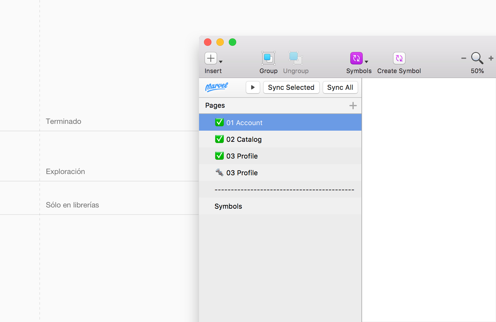
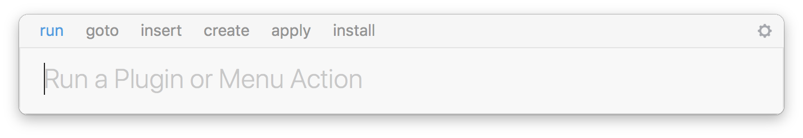
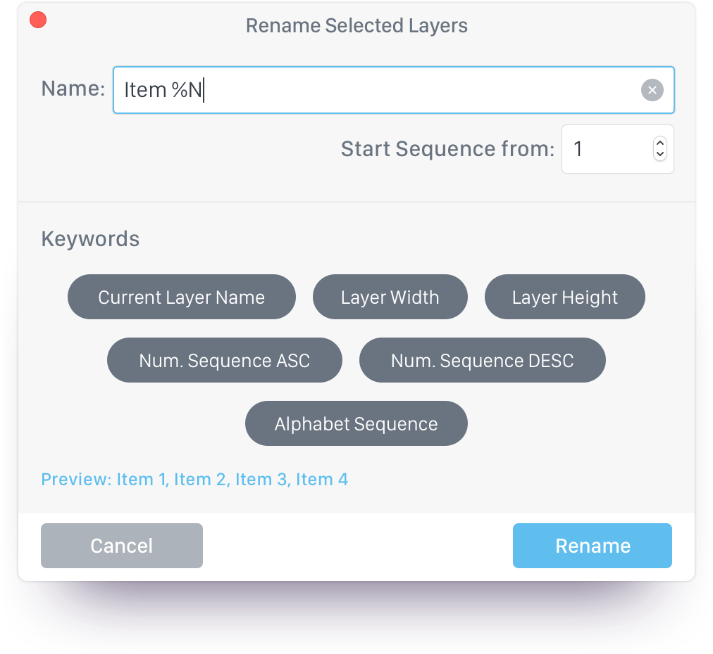
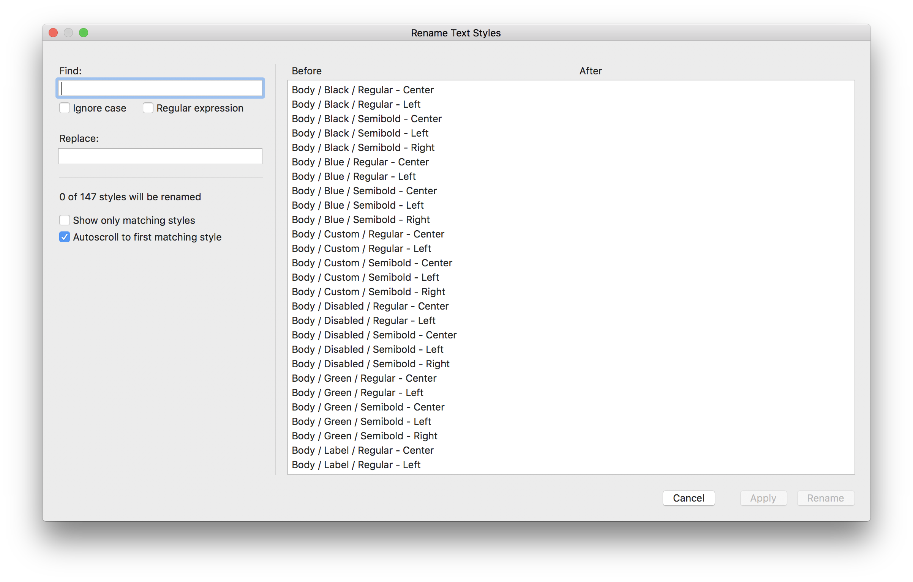
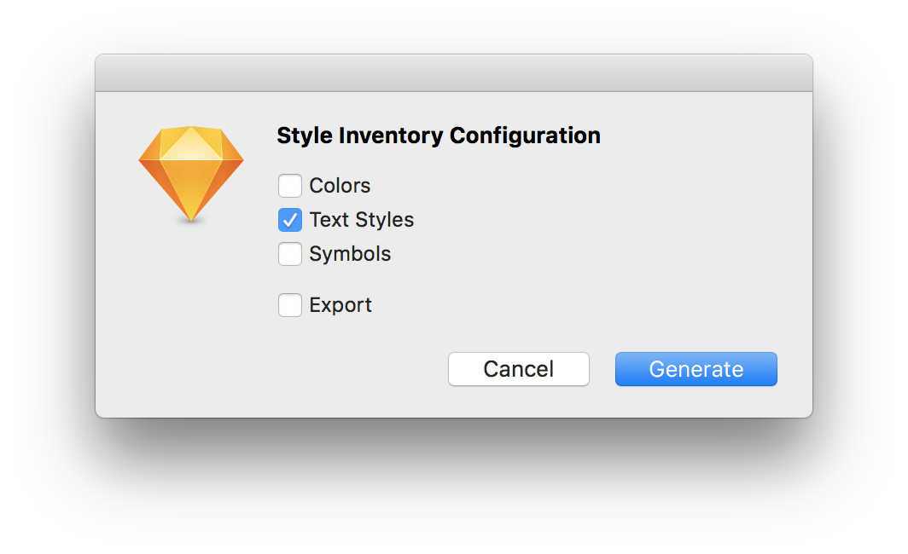
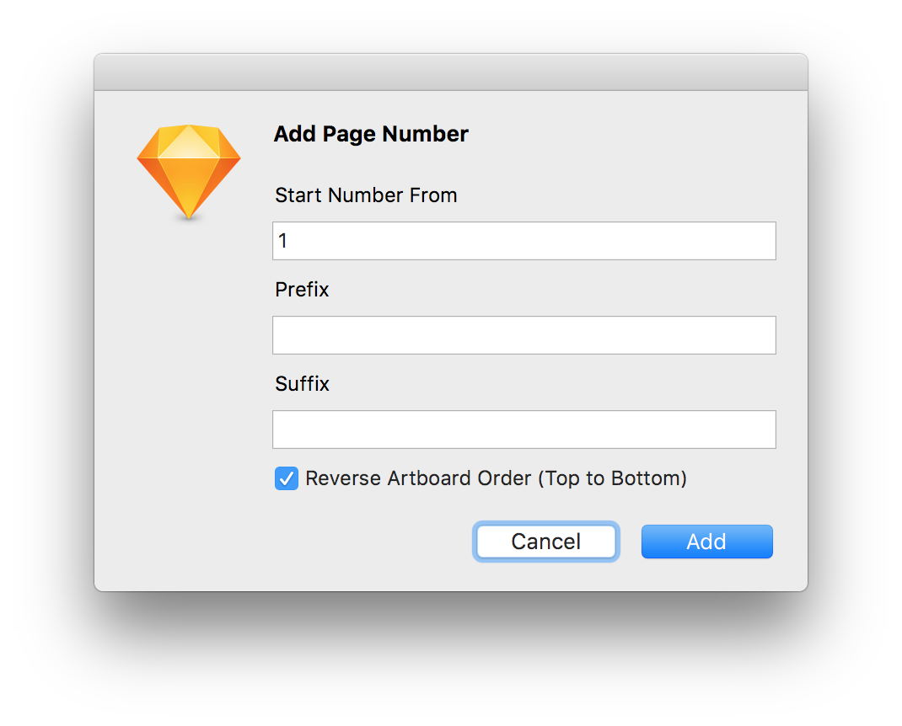

# Sketch

## Sketch

Sketch is the studio's main tool. Sketch is a part of our day-to-day workflow, and with which we design most of our projects.

This section details how we use Sketch, the way we organize it, and the plugins we use.

## 1. Organization

The basic organization of our Sketch files is based on pages, artboards, symbols, and shared styles.

### 1.1 Pages

In our Sketch files, you can find three types of pages, depending on their content and the status of the content.

**Pages in progress ⚙️**

The pages in progress are the ones you are currently working on. These are iterated on within the same artboard or element.

It is important for us to identify pages that are not finished because we are still working on them. These are pages in which the content does not have to be perfect.

**Master pages** **✅**

The master pages contain the finished content. The content of this page must be perfect, have implemented styles, be made up of components and respect the defined spacing.

**Symbols page \(Symbols\)**

In most of our projects, **this page only appears when the file is a library**, which contains the design system of our product.





This is our way of organizing Sketch, but it doesn't always have to be like this. This is our way of resolving conflicts about which pages are ready and which are being worked on.


In order to reflect these three types of pages and keep Sketch files consistent within all projects, we require that all pages have a visual identifier, a numerical identifier, and a descriptive name for their content.

Following the nomenclature:

```text
[Emoji] [Page id] [Page name]
```

* Emoji: we use ✅ for master pages and ⚙️ for pages in progress.
* Page id: Are an incremental numerical identification with a 0 \(zero\) as a prefix.

Un ejemplo sería:

* ✅ 02 Account
* ✅ 03 Catalog
* ⚙️ 04 Profile

### 1.2 Artboard

We group artboards into user flows or user stories. Each row represents a possible path for the application or web being designed. At the beginning of each row, there is an artboard containing the name and a description of the user flow being represented.

To name the artboards we use an ID, which corresponds to that particular page, and a number that consists of the row number and the screen number.

```text
[id]_[row number][screen number]
```

* The id refers to the id of the page

  ✏️ If the page is 01 Account → id page: 01

* The row number refers to the user flow number in which we find ourselves.

An example would be:

First user flow → row number: 1   
Second user flow → row number: 2  
Third user flow → row number: 3

* The screen number is incremental from left to right.

  ✏️ If 01 02 03 04 05 06 07 08 09 10 11 12

An example would be:

For the user flows on page 01 Account:

* 01\_100 01\_101 01\_102 01\_103
* 01\_200 01\_201 01\_202 01\_203 01\_204
* 01\_300 01\_301 01\_302 01\_303

### 1.3 Symbols

We use symbols to optimize and automate our work. Symbols make it easier for us to change multiple components at the same time.

The symbols in Sketch are located in a Sketch Library, a linked Sketch file we're working on. The use of libraries allows all Sketch files of a project to share components, thus avoiding duplicates that lead to an error.


✏️ To learn more about how we work with symbols and components you can read [**4. Design Systems.**](../design-systems.md)\*\*\*\*


### 1.4 Shared Styles

We work with two types of shared styles, text styles and layer styles.

Normally these reside in the library where the design system of our project is located, and will be applied to the file we are working on.

Styles, such as symbols and components, help us avoid inconsistencies and duplicities.

**Layer Styles**

The layer styles can be differentiated between color, opacity and shadows.

* Color

  Text styles must match the product's color palette. We create these in both color fills and outline.

* Opacity

  We apply opacity to the container group of an element or elements that we want to give a certain opacity. Thus, we control which opacities are used in the project. This allows us to update layer and text styles without losing the different opacities of the said style instances.

* Shadows

**Text Styles**

In all our files, texts have to have an assigned text style. This helps us to maintain consistency in the file and in the product.

## 2. Sketch plugins

The following are 5 Sketch plugins that help us efficiently work with Sketch 🚀.

### 2.1 [**Sketch Runner**](https://sketchrunner.com/)

Sketch Runner helps us search for everything you can imagine within Sketch, apply styles and insert symbols.



Sketch Runner allows:

* Executing plugins
* Install plugins
* Go to any page, artboard, group or layer in the Sketch document we are in. 
* Inserting Symbols 
* Create symbols 
* Create text styles and layer styles 
* Apply text styles and layer styles 
* Update outdated plugins

### 2.2 [**Automate Sketch**](https://github.com/Ashung/Automate-Sketch/)

Some of the things you can do with this plugin that make our every day easier are:

* Replace Fonts 
* Import Styles from Library 
* Replace Symbol with Library Symbol 
* Rename instances of symbols 
* Select Layer by Layer / Text Style 
* Resize artboards to fit the height of the layers and groups it contains \(Resize to a fixed height\)

### 2.3 [**Rename It**](https://rodi01.github.io/RenameIt/)

Rename It allows:

* Rename Layers 
* Rename artboards 
* Replace words with others \(Find and Replace\)

For us, it is very useful because it allows us to automatically add a sequence of numbers in ascending or descending order, which allows us to name the artboards easily.



### 2.4 [**Sketch Style Master**](https://github.com/aparajita/sketch-style-master)

It's similar to Rename It, but for text styles. It's really useful as it lets you rename text styles and replace their words.



### 2.5 [**Sketch Style Inventory**](https://github.com/getflourish/Sketch-Style-Inventory)

One of the great advantages of this plugin is being able to extract all the text styles that exist in the file. When you run the plugin, Sketch Style Inventory creates a page with all existing text styles.



It's really useful when you need to change a feature of a particular style. This way we can ensure that the change has been applied to all text styles.

Sketch Style Inventory can also generate all the colors and symbols present in the Sketch file, and even export them.

### 2.6 [**Sketch Page Numbers**](https://github.com/getflourish/Sketch-Style-Inventory)

This plugin allows you to add numbering to artboards in Sketch in such a way that they are numbered according to the order in which they appear in the list of layers \(they can also be numbered in reverse order\).



It is especially useful when designing Sketch documents such as brand books or concept presentations.

